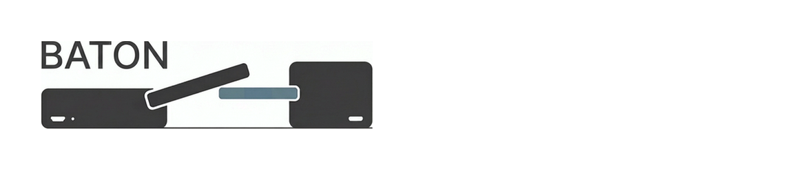

# Baton



**Baton** is a session handoff tool for Claude Code across machines.

It solves one problem:

> Can I continue the same Claude Code session on another machine without losing context?

```bash
baton push   # on machine A
baton pull   # on machine B
```

---

## Why it exists

Claude Code sessions are trapped on one machine:

- session context doesn't travel between devices
- macOS, Linux, and Windows use different paths, usernames, and home directories
- the same repo often lives at different absolute paths on different machines
- existing tools sync config, not coding sessions

Baton does not try to replace the agent itself.

It focuses on one job:

**push a session here, pull it there, keep working.**

---

## One-line positioning

**Git-backed session handoff for Claude Code.**

---

## How it works

1. You run `baton push` from a project directory
2. Baton auto-detects the project from the git remote
3. All Claude Code sessions for that project are captured
4. Absolute paths are replaced with portable placeholders
5. The checkpoint is pushed to a private GitHub repo
6. On another machine, `baton pull` restores the sessions
7. Placeholders are expanded to machine-local paths
8. Claude Code can continue where you left off

---

## Example

Same repo, different machines:

- macOS: `/Users/dr_who/work/foo`
- Linux: `/root/projects/foo`
- Windows: `C:\Users\dr_who\work\foo`

Baton identifies them as the same project from the git remote:

```bash
# on macOS
cd /Users/dr_who/work/foo
baton push

# on Linux
cd /root/projects/foo
baton pull
```

Path placeholders handle the differences automatically:

| Placeholder | macOS | Linux | Windows |
|-------------|-------|-------|---------|
| `${PROJECT_ROOT}` | `/Users/dr_who/work/foo` | `/root/projects/foo` | `C:\Users\dr_who\work\foo` |
| `${HOME}` | `/Users/dr_who` | `/root` | `C:\Users\dr_who` |

---

## What gets synced

| Component | Synced? | Why |
|-----------|---------|-----|
| Session conversation logs (all) | Yes | The sessions themselves |
| Tool results | Yes | Small, needed for reference integrity |
| Project memory | Yes | Tiny, valuable for continuity |
| Subagent logs | No | Too large, results already in main conversation |

---

## CLI

```bash
baton push              # push all sessions for this project
baton push --force      # overwrite remote even if ahead
baton pull              # restore sessions locally
baton status            # show current project and sync state
```

---

## What Baton is not

Baton is **not**:

- a real-time sync engine
- a multi-user collaboration platform
- a vector database or semantic memory system
- a config sync tool
- a full native state restoration guarantee

---

## Design principles

* **Project-aware**: project identity comes from git remote, not local paths
* **Checkpoint-first**: restore from snapshots, not fragile live mirroring
* **Portable before native**: prioritize continuity over perfect internal restoration
* **Git-backed**: use GitHub for durable history and recovery
* **Simple**: two commands, no daemon, no config ceremony

---

## Status

Early design / MVP planning.

v0.1 target:

> Push/pull Claude Code sessions across macOS, Linux, and Windows for the same logical project.

---

## License

MIT
